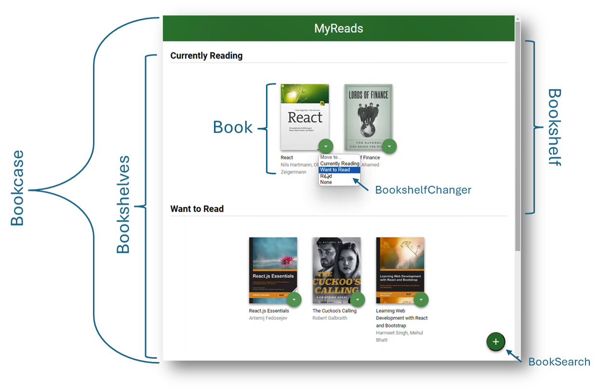
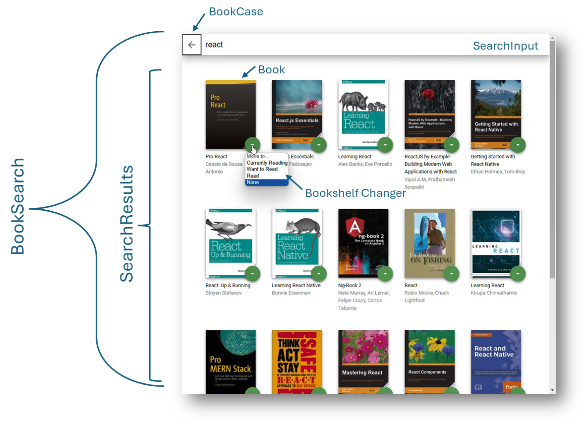

# Organization of the Project

This project is a book tracking app that allows you to search for books and add them to one of three shelves: Currently Reading, Want to Read, and Read. You can also move books between shelves and remove them from your collection. There is a search page that allows you to search for books and add them to your collection.

- [Organization of the Project](#organization-of-the-project)
  - [Page Design](#page-design)
  - [Directory Structure](#directory-structure)
  - [Backend Server](#backend-server)
    - [`getAll`](#getall)
    - [`update`](#update)
    - [`search`](#search)
  - [Important](#important)
- [Installation and Running](#installation-and-running)
- [Create React App](#create-react-app)
  - [Getting Started with Create React App](#getting-started-with-create-react-app)
  - [Available Scripts](#available-scripts)
    - [`npm start`](#npm-start)
    - [`npm test`](#npm-test)
    - [`npm run build`](#npm-run-build)
    - [`npm run eject`](#npm-run-eject)
  - [Learn More](#learn-more)
    - [Code Splitting](#code-splitting)
    - [Analyzing the Bundle Size](#analyzing-the-bundle-size)
    - [Making a Progressive Web App](#making-a-progressive-web-app)
    - [Advanced Configuration](#advanced-configuration)
    - [Deployment](#deployment)
    - [`npm run build` fails to minify](#npm-run-build-fails-to-minify)

## Page Design

On the main page, you can move books between shelves by selecting the shelf from the dropdown menu on each book. You can also remove books from your collection by selecting "None" from the dropdown menu. The main page also has a link to the search page where you can search for books and add them to your collection. Here is an image of the main page and the components that make up the page.



The search page has an input field where you can type in a search term. The search results will appear below the input field. You can add books to your collection by selecting the shelf from the dropdown menu on each book. Here is an image of the search page and the components that make up the page.



## Directory Structure

The project focusus primarily on developing a front end application in react. The project is organized into the following directories and files:

- `public` - contains the `index.html` file that is the entry point for the application.
- `src` - contains the source code for the application.
  - `components` - contains the react components that make up the application.
    - `Book.js` - the component that renders a single book.
    - `BookCase.js` - the component that renders the main page.
    - `BookShelf.js` - the component that renders a shelf of books.
    - `BookShelfChanger.js` - the component that renders the dropdown menu for changing the shelf of a book.
    - `Bookshelves.js` - the component that renders the different book shelves.
    - `SearchBooks.js` - the component that renders the search page.
    - `SearchInput.js` - the component that renders the search input field.
    - `SearchResults.js` - the component that renders the search results.
  - `hooks` - contains custom hooks used in the application.
    - `useQuery.js` - a custom hook that parses the query from the books search page.
  - `icons` - contains the icons used in the application.
  - `App.js` - the main component that renders the application.
  - `App.css` - the css file for the main component.
  - `BooksAPI.js` - the backend server for the application.
  - `index.js` - the entry point for the application.
  - `index.css` - the css file for the entry point.
  -

## Backend Server

A backend server is provided. The provided file [`BooksAPI.js`](src/BooksAPI.js) contains the methods you will need to perform necessary operations on the backend:

- [`getAll`](#getall)
- [`update`](#update)
- [`search`](#search)

### `getAll`

Method Signature:

```js
getAll();
```

- Returns a Promise which resolves to a JSON object containing a collection of book objects.
- This collection represents the books currently in the bookshelves in your app.

### `update`

Method Signature:

```js
update(book, shelf);
```

- book: `<Object>` containing at minimum an `id` attribute
- shelf: `<String>` contains one of ["wantToRead", "currentlyReading", "read"]
- Returns a Promise which resolves to a JSON object containing the response data of the POST request

### `search`

Method Signature:

```js
search(query);
```

- query: `<String>`
- Returns a Promise which resolves to a JSON object containing a collection of a maximum of 20 book objects.
- These books do not know which shelf they are on. They are raw results only. You'll need to make sure that books have the correct state while on the search page.

## Important

The backend API uses a fixed set of cached search results and is limited to a particular set of search terms. That list of terms are the _only_ terms that will work with the backend, so don't be surprised if your searches for Basket Weaving or Bubble Wrap don't come back with any results. If it doesn't work, just try a new search term.

# Installation and Running

Clone this repository

```bash
git clone https://github.com/StuKozola/Udacity-React-ND-MyReads-Project.git
```

To start the project, run the following commands:

```bash
cd Udacity-React-ND-MyReads-Project
cd myreads
npm install
npm start
```

The app should open in your default browser at http://localhost:3000/

# Create React App

This project was bootstrapped with [Create React App](https://github.com/facebook/create-react-app). You can find more information on how to perform common tasks [here](https://github.com/facebook/create-react-app/blob/main/packages/cra-template/template/README.md).

## Getting Started with Create React App

This project was bootstrapped with [Create React App](https://github.com/facebook/create-react-app). Follow the directions below if you wish to build this project from scratch.

## Available Scripts

In the project directory, you can run:

### `npm start`

Runs the app in the development mode.\
Open [http://localhost:3000](http://localhost:3000) to view it in your browser.

The page will reload when you make changes.\
You may also see any lint errors in the console.

### `npm test`

Launches the test runner in the interactive watch mode.\
See the section about [running tests](https://facebook.github.io/create-react-app/docs/running-tests) for more information.

### `npm run build`

Builds the app for production to the `build` folder.\
It correctly bundles React in production mode and optimizes the build for the best performance.

The build is minified and the filenames include the hashes.\
Your app is ready to be deployed!

See the section about [deployment](https://facebook.github.io/create-react-app/docs/deployment) for more information.

### `npm run eject`

**Note: this is a one-way operation. Once you `eject`, you can't go back!**

If you aren't satisfied with the build tool and configuration choices, you can `eject` at any time. This command will remove the single build dependency from your project.

Instead, it will copy all the configuration files and the transitive dependencies (webpack, Babel, ESLint, etc) right into your project so you have full control over them. All of the commands except `eject` will still work, but they will point to the copied scripts so you can tweak them. At this point you're on your own.

You don't have to ever use `eject`. The curated feature set is suitable for small and middle deployments, and you shouldn't feel obligated to use this feature. However we understand that this tool wouldn't be useful if you couldn't customize it when you are ready for it.

## Learn More

You can learn more in the [Create React App documentation](https://facebook.github.io/create-react-app/docs/getting-started).

To learn React, check out the [React documentation](https://reactjs.org/).

### Code Splitting

This section has moved here: [https://facebook.github.io/create-react-app/docs/code-splitting](https://facebook.github.io/create-react-app/docs/code-splitting)

### Analyzing the Bundle Size

This section has moved here: [https://facebook.github.io/create-react-app/docs/analyzing-the-bundle-size](https://facebook.github.io/create-react-app/docs/analyzing-the-bundle-size)

### Making a Progressive Web App

This section has moved here: [https://facebook.github.io/create-react-app/docs/making-a-progressive-web-app](https://facebook.github.io/create-react-app/docs/making-a-progressive-web-app)

### Advanced Configuration

This section has moved here: [https://facebook.github.io/create-react-app/docs/advanced-configuration](https://facebook.github.io/create-react-app/docs/advanced-configuration)

### Deployment

This section has moved here: [https://facebook.github.io/create-react-app/docs/deployment](https://facebook.github.io/create-react-app/docs/deployment)

### `npm run build` fails to minify

This section has moved here: [https://facebook.github.io/create-react-app/docs/troubleshooting#npm-run-build-fails-to-minify](https://facebook.github.io/create-react-app/docs/troubleshooting#npm-run-build-fails-to-minify)
